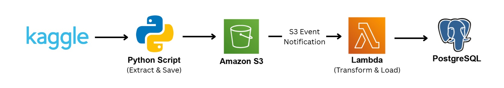

# Kaggle E-Commerce ETL Pipeline  
## Clean, Transform, and Load Sales Data from S3 to PostgreSQL using AWS Lambda  

A serverless ETL pipeline that ingests raw CSVs from a Kaggle e-commerce dataset, performs data cleaning and transformation, and loads the cleaned data into PostgreSQL. The project uses AWS Lambda, S3, and triggers, and is designed to be scalable and modular — perfect for real-world data engineering tasks.

---

## 🧠 What This Project Does

This project automates the process of:
- Receiving raw CSV reports (`Amazon Sale`, `Sale`, and `International Sale`) uploaded to an S3 bucket.
- Automatically triggering a Lambda function (`Lambda B`) when a new file appears in `kaggle/raw/`.
- Cleaning, transforming, and validating each file based on custom business rules.
- Saving cleaned versions back to S3 under `kaggle/cleaned/`.
- Loading structured data into a PostgreSQL RDS instance with well-designed schema and deduplication logic.

An optional `Lambda A` function is used to simulate or manually upload these raw files to S3.  

---

## 📊 Architecture



---

## 📽️ Video Demo


---

## 📦 Dataset Overview

The dataset is based on Kaggle's e-commerce sales data, consisting of 3 types of reports:
```
* `Amazon Sale Report_<timestamp>.csv`
    - Detailed order data from Amazon with duplicates and noise. 
* `Sale Report_<timestamp>.csv` 
    - Local sales data, more consistent but still requires cleaning. 
* `International Sale Report_<timestamp>.csv` 
    - Complex format with misaligned rows requiring separation. 
```
These files are uploaded to the S3 bucket under the `kaggle/raw/` prefix and automatically trigger the ETL.

---

## 🧹 Data Cleaning & Transformation Logic

### 🟦 Amazon Sale Report
- Drops noisy columns like `Unnamed: 22`, `promotion-ids`, etc.
- Standardizes text fields and column names.
- Handles conflicting `order_id`s:
  - Clean rows → `amazon_sale` table
  - Conflicts → `amazon_sale_version` table

### 🟨 Sale Report
- Performs basic cleanup: drops `index`, handles NA values, standardizes fields
- Loaded directly into the `sale` table

### 🟩 International Sale Report
- Detects and separates misaligned row groups
- Cleans and standardizes both parts (`part1`, `part2`)
- Loads both into `international_sales` with a `data_source` tag

---

## 🚀 Deployment and Usage

### ✅ Prerequisites
- AWS Account (with access to Lambda, S3, IAM, RDS)
- PostgreSQL instance (AWS RDS or local)
- Configured environment variables (set in Lambda console):
  - `POSTGRES_USER`, `POSTGRES_PASS`, `POSTGRES_HOST`, `POSTGRES_DB`
  - `S3_BUCKET`

### ⚙️ How it works
1. Upload any of the following files to `s3://<your-bucket>/kaggle/raw/`:
   - `Amazon Sale Report_*.csv`
   - `Sale Report_*.csv`
   - `International Sale Report_*.csv`
2. This upload triggers `Lambda B`, which:
   - Identifies the file type
   - Cleans/transforms the file accordingly
   - Uploads cleaned files to `kaggle/cleaned/`
   - Loads data into PostgreSQL

### 🧪 Local Development (for contributors)

```
# Clone the repo
git clone https://github.com/yourusername/kaggle-ecommerce-etl.git
cd kaggle-ecommerce-etl

# Set up a virtual environment
python -m venv venv
source venv/bin/activate  # or venv\Scripts\activate on Windows

# Install dependencies
pip install -r requirements.txt
````

---

## 🤝 Contribution Guidelines

* Pull requests and issues are welcome!
* Please follow this workflow:

  1. Fork the repository
  2. Create a new branch
  3. Submit a PR with a clear title and description
* Ensure code is clean, logged, and tested

---

## 🐛 Known Issues

* **Multiple Lambda Invocations from Single Upload Batch** — Currently, the S3 Event Notification is configured to trigger `Lambda B` whenever a new file appears in `kaggle/raw/`. When uploading multiple CSV files at once (e.g., `Amazon Sale`, `Sale`, and `International Sale`), S3 sends a separate event for each file. This results in multiple near-simultaneous Lambda invocations, which can cause:
  - Duplicate logs in CloudWatch.
  - Multiple copies of the same cleaned file in the backup folder.
  - Redundant database inserts if deduplication is not handled carefully.

  **Planned Solution:** Replace the direct S3 Event Notification trigger with an **Amazon EventBridge scheduled rule**. Instead of triggering immediately for each file, the pipeline will run on a set schedule (e.g., every 1 week), scan for new files in `kaggle/raw/`, and process them in a single batch. This will:
  - Eliminate duplicate processing from multi-file uploads.
  - Simplify logging and error tracking.
  - Allow for more controlled ingestion workflows.

* No scheduler yet for Lambda A (can be triggered manually).
* Schema assumes data columns are stable across uploads.
* International Sale format varies across files — pipeline currently assumes best-effort structure.

---

## 🙋‍♂️ Author

**Jhon Kelly Romero**
Passionate about data engineering, automation, and serverless pipelines.

---

## 💼 Purpose

This project is part of my **data engineering portfolio** and demonstrates my ability to build and deploy production-style ETL pipelines on AWS using S3, Lambda, and PostgreSQL.
